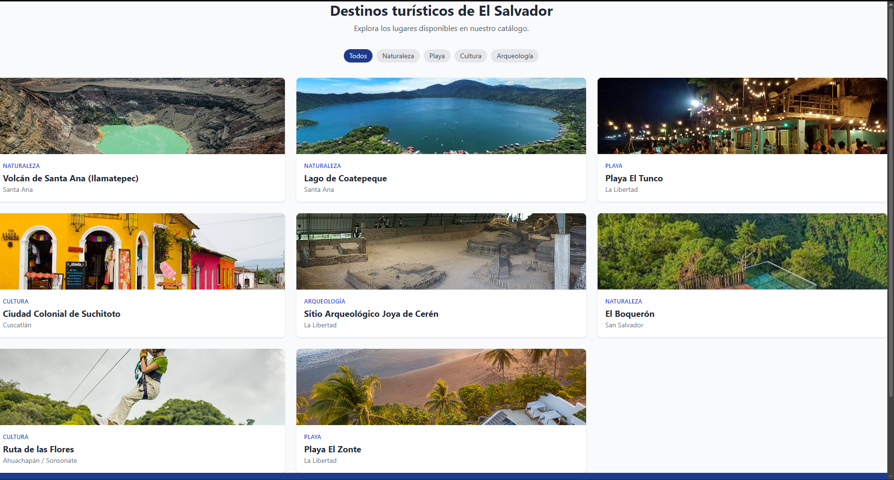

# Catálogo Turístico de El Salvador — Laravel MVC

Aplicación web desarrollada en Laravel que demuestra la implementación del
patrón **MVC (Modelo–Vista–Controlador)** mediante un catálogo de lugares
turísticos de El Salvador. Los datos se almacenan y se leen desde
**archivos JSON**, en lugar de una base de datos, para poner el foco en el
flujo de datos entre capas más que en la persistencia relacional.

---

## Descripción del caso

La aplicación permite:

- Explorar destinos turísticos disponibles, con filtro por categoría.
- Visualizar el detalle de un lugar específico (título, departamento,
  categoría, precios, horario, cómo llegar, etc.).
- Enviar un formulario de contacto para solicitar más información sobre
  un lugar; la solicitud se valida y se guarda en un archivo JSON.

---

## Arquitectura MVC implementada

```
Petición HTTP del navegador
        │
        ▼
routes/web.php  ──────────────► Enrutador: mapea URI + verbo HTTP a un método
        │                        de un Controlador
        ▼
app/Http/Controllers/
  ├── LugarController.php  ────► Orquesta la lógica de listar/mostrar lugares
  └── ContactoController.php ──► Orquesta la lógica del formulario de contacto
        │
        ▼
app/Models/
  ├── Lugar.php  ───────────────► Lee y filtra storage/app/data/lugares.json
  └── SolicitudContacto.php ────► Valida y persiste en storage/app/data/solicitudes.json
        │
        ▼
resources/views/
  ├── layouts/app.blade.php
  ├── lugares/index.blade.php ─► Lista de destinos
  ├── lugares/show.blade.php ──► Detalle de un destino
  └── contacto/create.blade.php ► Formulario de contacto
        │
        ▼
Respuesta HTML renderizada al navegador
```

### Ciclo de vida de una petición (ejemplo: ver el detalle de un lugar)

1. El navegador solicita `GET /lugares/3`.
2. `routes/web.php` reconoce la ruta y la envía a
   `LugarController@show`.
3. El controlador llama a `Lugar::buscarPorId(3)`.
4. El **Modelo** `Lugar` lee `storage/app/data/lugares.json`, lo decodifica
   con `json_decode` y devuelve el arreglo asociativo correspondiente al
   lugar con `id = 3`.
5. El controlador pasa esos datos a la **Vista**
   `resources/views/lugares/show.blade.php` mediante `compact('lugar')`.
6. Blade renderiza el HTML final combinando la plantilla con los datos.
7. Laravel devuelve la respuesta HTTP con el HTML al navegador.

### Ejemplo de flujo de escritura (formulario de contacto)

1. El usuario llena el formulario en `contacto/create.blade.php` y envía
   `POST /contacto/3`.
2. `ContactoController@store` valida los datos (`$request->validate(...)`).
3. Si son válidos, llama a `SolicitudContacto::guardar($datos)`.
4. El modelo `SolicitudContacto` lee el JSON existente, agrega el nuevo
   registro (con id y fecha autogenerados) y vuelve a escribir el archivo
   `storage/app/data/solicitudes.json`.
5. El controlador redirige de vuelta al detalle del lugar con un mensaje
   flash de éxito (`session('exito')`), que la vista muestra en el layout.

Esto ilustra las **dos direcciones** del flujo de datos en MVC:
lectura (Modelo → Controlador → Vista) y escritura
(Vista → Controlador → Modelo → almacenamiento).

---

## ️ Estructura relevante del proyecto

```
app/
  Http/Controllers/
    LugarController.php
    ContactoController.php
  Models/
    Lugar.php
    SolicitudContacto.php
routes/
  web.php
resources/views/
  layouts/app.blade.php
  lugares/index.blade.php
  lugares/show.blade.php
  contacto/create.blade.php
storage/app/data/
  lugares.json          <- fuente de datos de lugares turísticos
  solicitudes.json       <- datos generados por el formulario de contacto
```

---

## ️ Instalación y ejecución

### Requisitos previos

- PHP >= 8.1
- Composer
- (Opcional) Node.js si se desea recompilar assets, aunque este proyecto
  usa Tailwind vía CDN y no lo requiere.

### Pasos

1. **Crear un proyecto base de Laravel** (este repositorio no incluye el
   framework completo ni la carpeta `vendor/`, siguiendo la práctica
   estándar de no versionar dependencias):

   ```bash
   composer create-project laravel/laravel catalogo-turistico
   cd catalogo-turistico
   ```

2. **Copiar los archivos de este repositorio** sobre el proyecto recién
   creado, reemplazando cuando corresponda:

   - `app/Http/Controllers/LugarController.php`
   - `app/Http/Controllers/ContactoController.php`
   - `app/Models/Lugar.php`
   - `app/Models/SolicitudContacto.php`
   - `routes/web.php`
   - `resources/views/layouts/app.blade.php`
   - `resources/views/lugares/`
   - `resources/views/contacto/`
   - `storage/app/data/lugares.json`
   - `storage/app/data/solicitudes.json`

3. **Configurar el entorno**:

   ```bash
   cp .env.example .env
   php artisan key:generate
   ```

   > No se requiere configurar base de datos: la aplicación no usa
   > `DB_*` ni migraciones, ya que toda la persistencia ocurre en
   > archivos JSON dentro de `storage/app/data/`.

4. **Verificar permisos** de escritura sobre `storage/` (necesarios para
   guardar nuevas solicitudes de contacto):

   ```bash
   chmod -R 775 storage
   ```

5. **Levantar el servidor de desarrollo**:

   ```bash
   php artisan serve
   ```

6. Abrir el navegador en [http://localhost:8000](http://localhost:8000).

### Rutas principales

| Método | URI              | Controlador@Método         | Descripción                       |
|--------|------------------|-----------------------------|------------------------------------|
| GET    | `/`              | `LugarController@index`     | Listado de lugares (con filtro)   |
| GET    | `/lugares/{id}`  | `LugarController@show`      | Detalle de un lugar                |
| GET    | `/contacto/{id}` | `ContactoController@create` | Formulario de contacto            |
| POST   | `/contacto/{id}` | `ContactoController@store`  | Procesa y guarda la solicitud     |

---

## Capturas de pantalla

> Agregar aquí las capturas del sistema en funcionamiento una vez desplegado
> localmente (se recomienda guardarlas en una carpeta `docs/` o `screenshots/`
> del repositorio y enlazarlas a continuación).

- **Listado de lugares turísticos:** 
- **Detalle de un lugar:** ``
- **Formulario de contacto:** ``
- **Confirmación de envío:** ``
- **Confirmacion de recepcion:** ``

---

## Datos de prueba

Los datos de prueba se encuentran en:

- `storage/app/data/lugares.json` — 8 destinos turísticos de El Salvador
  (Volcán de Santa Ana, Lago de Coatepeque, Playa El Tunco, Suchitoto,
  Joya de Cerén, El Boquerón, Ruta de las Flores y Playa El Zonte).
- `storage/app/data/solicitudes.json` — inicia vacío y se completa
  automáticamente cada vez que alguien envía el formulario de contacto.

---

## Objetivo académico

Este proyecto fue desarrollado como actividad evaluada para demostrar la
comprensión del patrón MVC en Laravel: cómo una petición HTTP recorre el
enrutador, el controlador y el modelo antes de convertirse en una vista
renderizada, y cómo los datos fluyen en ambas direcciones entre las capas
de presentación y lógica de negocio.
